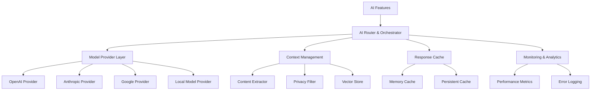

# AI Engine Foundation - Design Document

## Overview

The AI Engine Foundation serves as the central hub for all AI operations in Project Aura, providing a unified, secure, and efficient interface for AI model integration, context management, and response processing. This system abstracts the complexity of multiple AI providers while ensuring privacy, performance, and reliability.

The design emphasizes modularity, allowing independent scaling and optimization of different AI capabilities while maintaining consistent interfaces for feature development.

## Architecture

### High-Level System Architecture



### Component Architecture

**AI Router Layer:**
- Query analysis and intent classification
- Model selection and load balancing
- Response aggregation and synthesis
- Error handling and fallback management

**Model Provider Layer:**
- Standardized AI model interfaces
- Provider-specific implementations
- Authentication and rate limiting
- Cost tracking and optimization

**Context Management Layer:**
- Browser content extraction
- Privacy-safe data processing
- Vector embedding generation
- Semantic search and retrieval

**Caching Layer:**
- Intelligent response caching
- Cache invalidation strategies
- Performance optimization
- Cost reduction through reuse

## Components and Interfaces

### 1. AI Router and Orchestrator

**Purpose:** Central coordination of all AI operations with intelligent routing and fallback handling

**Interface Definition:**
```typescript
interface AIRouter {
  processQuery(query: AIQuery): Promise<AIResponse>;
  selectProvider(queryType: QueryType, requirements: ModelRequirements): AIProvider;
  aggregateResponses(responses: ProviderResponse[]): AIResponse;
  handleFallback(failedProvider: string, query: AIQuery): Promise<AIResponse>;
}

interface AIQuery {
  id: string;
  content: string;
  type: QueryType;
  context?: BrowserContext;
  requirements: ModelRequirements;
  userPreferences: UserPreferences;
}

interface AIResponse {
  content: string;
  confidence: number;
  sources: Source[];
  metadata: ResponseMetadata;
  processingTime: number;
}
```### 2
. Model Provider Interface

**Purpose:** Standardized interface for all AI model providers with consistent error handling and authentication

**Interface Definition:**
```typescript
interface AIProvider {
  name: string;
  capabilities: ModelCapability[];
  sendQuery(query: string, options: QueryOptions): Promise<ProviderResponse>;
  isAvailable(): Promise<boolean>;
  getCost(query: string): number;
  getLatency(): number;
  authenticate(): Promise<boolean>;
}

interface ModelCapability {
  type: CapabilityType;
  maxTokens: number;
  supportedFormats: string[];
  specializations: string[];
}

interface ProviderResponse {
  content: string;
  usage: TokenUsage;
  metadata: ProviderMetadata;
  confidence?: number;
}
```

### 3. Context Management System

**Purpose:** Secure extraction, processing, and storage of browser context for AI operations

**Interface Definition:**
```typescript
interface ContextManager {
  extractContext(options: ExtractionOptions): Promise<BrowserContext>;
  filterSensitiveData(content: string): Promise<FilteredContent>;
  generateEmbeddings(content: string[]): Promise<VectorEmbedding[]>;
  searchSimilar(query: string, limit: number): Promise<ContextMatch[]>;
  updateContext(tabId: string, content: PageContent): Promise<void>;
}

interface BrowserContext {
  activeTab: TabContext;
  relatedTabs: TabContext[];
  userActivity: ActivityContext;
  temporalContext: TemporalContext;
}

interface FilteredContent {
  content: string;
  removedItems: SensitiveItem[];
  privacyLevel: PrivacyLevel;
}
```

### 4. Privacy and Security Framework

**Purpose:** Comprehensive privacy protection and security for all AI operations

**Interface Definition:**
```typescript
interface PrivacyFramework {
  detectSensitiveData(content: string): Promise<SensitiveDataReport>;
  anonymizeContent(content: string): Promise<AnonymizedContent>;
  requestUserConsent(dataType: DataType, purpose: string): Promise<boolean>;
  encryptData(data: any, context: string): Promise<EncryptedData>;
  auditDataAccess(operation: string, data: any): Promise<void>;
}

interface SensitiveDataReport {
  items: SensitiveItem[];
  riskLevel: RiskLevel;
  recommendations: string[];
}

interface AnonymizedContent {
  content: string;
  anonymizationMap: Map<string, string>;
  reversible: boolean;
}
```

### 5. Response Cache System

**Purpose:** Intelligent caching of AI responses for performance optimization and cost reduction

**Interface Definition:**
```typescript
interface ResponseCache {
  get(key: string): Promise<CachedResponse | null>;
  set(key: string, response: AIResponse, ttl?: number): Promise<void>;
  invalidate(pattern: string): Promise<void>;
  getStats(): Promise<CacheStats>;
  optimize(): Promise<OptimizationReport>;
}

interface CachedResponse {
  response: AIResponse;
  timestamp: Date;
  hitCount: number;
  lastAccessed: Date;
}
```

## Data Models

### AI Query Processing Model

```typescript
interface QueryProcessingPipeline {
  preprocessing: PreprocessingStep[];
  routing: RoutingDecision;
  execution: ExecutionPlan;
  postprocessing: PostprocessingStep[];
  caching: CachingStrategy;
}

interface RoutingDecision {
  primaryProvider: string;
  fallbackProviders: string[];
  reasoning: string;
  confidence: number;
}
```

### Context Vector Model

```typescript
interface ContextVector {
  id: string;
  content: string;
  embedding: number[];
  metadata: VectorMetadata;
  source: ContextSource;
  timestamp: Date;
  relevanceScore?: number;
}

interface VectorMetadata {
  contentType: string;
  language: string;
  domain: string;
  quality: number;
}
```

## Performance Optimization

### Response Streaming
- Real-time response streaming for immediate user feedback
- Chunked processing for large responses
- Progressive enhancement of response quality
- Adaptive streaming based on network conditions

### Intelligent Caching
- Semantic similarity-based cache matching
- Automatic cache invalidation based on content changes
- Multi-level caching (memory, disk, distributed)
- Cache warming for frequently accessed content

### Resource Management
- Dynamic resource allocation based on demand
- Automatic scaling of AI processing capacity
- Priority queuing for user-facing operations
- Background processing for non-critical tasks

## Security Architecture

### Data Protection
- End-to-end encryption for all AI data
- Zero-knowledge architecture where possible
- Secure key management and rotation
- Automatic data expiration and cleanup

### Access Control
- Role-based access control for AI operations
- Permission-based API access
- Audit logging for all data access
- User consent management and tracking

### Threat Mitigation
- Input validation and sanitization
- Output filtering and verification
- Anomaly detection and alerting
- Incident response and recovery procedures

This design provides the foundational AI infrastructure that all Project Aura AI features will build upon, ensuring security, performance, and scalability.