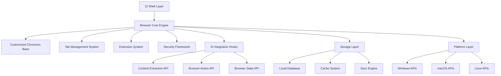

# Browser Core Foundation - Design Document

## Overview

The Browser Core Foundation provides the fundamental architecture for Project Aura, built on a customized Chromium base with native AI integration points. This design ensures web compatibility while enabling the advanced AI features that differentiate Project Aura from traditional browsers.

The architecture follows a modular approach with clear separation between browser engine, UI layer, and AI integration points, allowing for independent development and testing of components while maintaining system cohesion.

## Architecture

### High-Level System Architecture



### Component Architecture

**Browser Engine Layer:**

- Customized Chromium rendering engine
- Process isolation and sandboxing
- Network stack and security protocols
- Web standards compliance

**Tab Management Layer:**

- Tab lifecycle management
- Memory optimization and suspension
- Tab grouping and spaces
- Cross-tab communication

**AI Integration Layer:**

- Content extraction APIs
- Browser action automation
- State monitoring and events
- Privacy-safe data access

**Security Layer:**

- Sandboxing and process isolation
- Encryption and secure storage
- Privacy controls and filtering
- Threat detection and mitigation

## Components and Interfaces

### 1. Chromium Engine Wrapper

**Purpose:** Provides controlled access to Chromium functionality with AI integration hooks

**Key Features:**

- Custom Chromium build with AI-specific patches
- Process isolation for security and stability
- Web standards compliance with enhanced capabilities
- Performance monitoring and optimization

**Interface Definition:**

```typescript
interface ChromiumEngine {
  createTab(url: string, options?: TabOptions): Promise<Tab>;
  destroyTab(tabId: string): Promise<void>;
  navigateTab(tabId: string, url: string): Promise<void>;
  extractContent(tabId: string, options?: ExtractionOptions): Promise<PageContent>;
  injectScript(tabId: string, script: string): Promise<any>;
  addEventListener(event: BrowserEvent, handler: EventHandler): void;
}

interface TabOptions {
  background?: boolean;
  parentTabId?: string;
  groupId?: string;
  spaceId?: string;
}

interface PageContent {
  title: string;
  url: string;
  text: string;
  html: string;
  metadata: PageMetadata;
  elements: ExtractedElement[];
}
```

### 2. Tab Management System

**Purpose:** Advanced tab organization and lifecycle management beyond standard browser capabilities

**Key Features:**

- Unlimited tabs with efficient memory management
- Tab spaces and groups with visual organization
- Automatic tab suspension and restoration
- Cross-tab communication and coordination

**Interface Definition:**

```typescript
interface TabManager {
  createSpace(name: string, options?: SpaceOptions): Promise<Space>;
  createGroup(spaceId: string, name: string): Promise<TabGroup>;
  moveTab(tabId: string, targetGroupId: string): Promise<void>;
  suspendTab(tabId: string): Promise<void>;
  restoreTab(tabId: string): Promise<void>;
  getTabsBySpace(spaceId: string): Promise<Tab[]>;
  searchTabs(query: string): Promise<Tab[]>;
}

interface Space {
  id: string;
  name: string;
  groups: TabGroup[];
  settings: SpaceSettings;
  createdAt: Date;
}

interface TabGroup {
  id: string;
  name: string;
  color: string;
  tabs: Tab[];
  collapsed: boolean;
}
```

### 3. Security Framework

**Purpose:** Comprehensive security and privacy protection for browser operations and AI features

**Key Features:**

- Multi-layer sandboxing and process isolation
- Encrypted storage and secure communication
- Privacy-preserving content analysis
- Threat detection and mitigation

**Interface Definition:**

```typescript
interface SecurityFramework {
  createSandbox(permissions: Permission[]): Promise<Sandbox>;
  encryptData(data: any, context: string): Promise<EncryptedData>;
  decryptData(encrypted: EncryptedData, context: string): Promise<any>;
  validatePermission(action: string, context: SecurityContext): Promise<boolean>;
  scanForThreats(content: string): Promise<ThreatReport>;
  filterSensitiveData(content: string): Promise<FilteredContent>;
}

interface SecurityContext {
  tabId?: string;
  origin?: string;
  userPermissions: Permission[];
  privacyLevel: PrivacyLevel;
}

interface ThreatReport {
  threats: Threat[];
  riskLevel: RiskLevel;
  recommendations: string[];
}
```

### 4. AI Integration Hooks

**Purpose:** Secure and controlled APIs for AI features to access browser functionality

**Key Features:**

- Privacy-safe content extraction
- Controlled browser automation
- Real-time state monitoring
- Event-driven AI triggers

**Interface Definition:**

```typescript
interface AIIntegrationHooks {
  extractPageContent(tabId: string, options: ExtractionOptions): Promise<SafeContent>;
  performBrowserAction(action: BrowserAction): Promise<ActionResult>;
  subscribeToEvents(events: BrowserEvent[], handler: EventHandler): Subscription;
  requestUserPermission(permission: AIPermission): Promise<boolean>;
  getCrossTabContext(options: ContextOptions): Promise<CrossTabContext>;
}

interface SafeContent {
  content: string;
  metadata: ContentMetadata;
  privacyLevel: PrivacyLevel;
  sources: ContentSource[];
}

interface BrowserAction {
  type: ActionType;
  target: ActionTarget;
  parameters: ActionParameters;
  requiresConfirmation: boolean;
}
```

### 5. Extension System

**Purpose:** Chrome extension compatibility with enhanced AI-aware capabilities

**Key Features:**

- 95%+ Chrome extension compatibility
- AI-enhanced extension APIs
- Secure extension sandboxing
- Extension conflict resolution

**Interface Definition:**

```typescript
interface ExtensionSystem {
  loadExtension(manifest: ExtensionManifest): Promise<Extension>;
  unloadExtension(extensionId: string): Promise<void>;
  getExtensionAPI(extensionId: string): ExtensionAPI;
  resolveConflicts(conflicts: ExtensionConflict[]): Promise<Resolution[]>;
  enhanceWithAI(extensionId: string, capabilities: AICapability[]): Promise<void>;
}

interface ExtensionAPI {
  tabs: TabsAPI;
  storage: StorageAPI;
  runtime: RuntimeAPI;
  ai?: AIEnhancedAPI; // Project Aura specific
}
```

## Data Models

### Browser State Model

```typescript
interface BrowserState {
  spaces: Space[];
  activeSpaceId: string;
  activeTabId: string;
  settings: BrowserSettings;
  extensions: Extension[];
  session: SessionInfo;
}

interface BrowserSettings {
  privacy: PrivacySettings;
  performance: PerformanceSettings;
  ui: UISettings;
  ai: AISettings;
}
```

### Tab Model

```typescript
interface Tab {
  id: string;
  url: string;
  title: string;
  favicon: string;
  status: TabStatus;
  groupId?: string;
  spaceId: string;
  suspended: boolean;
  lastActive: Date;
  memoryUsage: number;
  aiContext?: AIContext;
}

enum TabStatus {
  Loading = 'loading',
  Complete = 'complete',
  Error = 'error',
  Suspended = 'suspended'
}
```

## Performance Optimization

### Memory Management

- Automatic tab suspension based on usage patterns
- Efficient DOM tree caching and cleanup
- Memory pooling for frequently created objects
- Garbage collection optimization for long-running sessions

### Process Architecture

- Multi-process isolation for security and stability
- Dedicated processes for AI operations
- Efficient inter-process communication
- Resource monitoring and automatic scaling

### Rendering Optimization

- Hardware acceleration for UI and web content
- Efficient repainting and compositing
- Lazy loading of non-critical components
- Adaptive quality based on system resources

## Security Architecture

### Sandboxing Strategy

- Process-level isolation for tabs and extensions
- Restricted API access based on permissions
- Content Security Policy enforcement
- Network request filtering and validation

### Data Protection

- End-to-end encryption for sensitive data
- Secure key management and rotation
- Privacy-preserving analytics and telemetry
- Automatic data expiration and cleanup

### Threat Mitigation

- Real-time malware and phishing detection
- Automatic security updates and patches
- User education and warning systems
- Incident response and recovery procedures

## Cross-Platform Considerations

### Platform Abstraction

- Unified API across Windows, macOS, and Linux
- Platform-specific optimizations and integrations
- Native look and feel while maintaining consistency
- Efficient resource usage on each platform

### Distribution Strategy

- Automated build and packaging for all platforms
- Code signing and security verification
- Update delivery and installation mechanisms
- Platform-specific installation and uninstallation

## Testing Strategy

### Unit Testing

- Component isolation with comprehensive mocking
- API contract validation and compliance testing
- Performance benchmarking and regression testing
- Security vulnerability scanning and validation

### Integration Testing

- Cross-component interaction validation
- Extension compatibility testing
- AI integration hook verification
- Platform-specific functionality testing

### Performance Testing

- Load testing with realistic usage scenarios
- Memory leak detection and prevention
- Startup time and responsiveness benchmarking
- Resource usage optimization validation

## Deployment Architecture

### Build System

- Automated Chromium customization and patching
- Cross-platform compilation and optimization
- Asset bundling and compression
- Quality gates and automated testing

### Update Mechanism

- Differential updates for efficiency
- Rollback capability for failed updates
- A/B testing for gradual feature rollouts
- Emergency update deployment for security issues

This design provides the foundational architecture that all Project Aura AI features will build upon, ensuring security, performance, and extensibility while maintaining web standards compliance.
