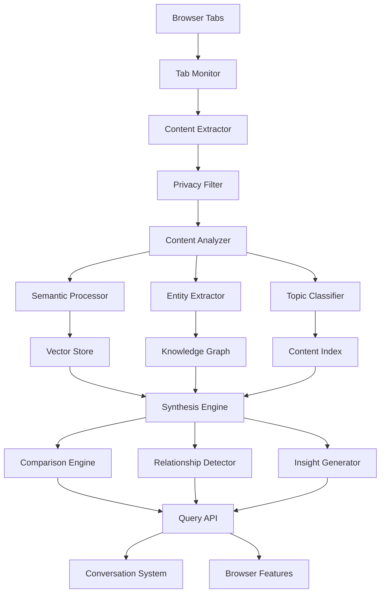

# Cross-Tab Intelligence - Design Document

## Overview

Cross-Tab Intelligence serves as the cognitive backbone of Project Aura, providing real-time analysis and synthesis of information across multiple browser tabs. The system creates a semantic understanding of the user's browsing context, enabling intelligent insights, comparisons, and connections that would be impossible with traditional browsing.

The design emphasizes privacy-first processing, real-time performance, and seamless integration with other browser features. The system operates as both a background service and an active analysis engine, adapting its processing intensity based on user activity and system resources.

## Architecture

### High-Level System Architecture



### Component Architecture

The system follows a pipeline architecture with parallel processing streams:

**Input Layer:**
- Tab monitoring and change detection
- Content extraction and preprocessing
- Privacy filtering and permission management

**Processing Layer:**
- Semantic analysis and vector generation
- Entity extraction and knowledge graph building
- Topic classification and content indexing

**Intelligence Layer:**
- Cross-tab relationship detection
- Information synthesis and comparison
- Insight generation and ranking

**Output Layer:**
- Query processing and response generation
- Integration with conversation system
- Browser feature enhancement

## Components and Interfaces

### 1. Tab Monitor and Content Extractor

**Purpose:** Continuously monitors tab state and extracts content for analysis

**Key Features:**
- Real-time tab change detection
- Efficient content extraction with DOM parsing
- Incremental updates for dynamic content
- Resource usage optimization
- Privacy-aware content filtering

**Interface Definition:**
```typescript
interface TabMonitor {
  startMonitoring(): void;
  stopMonitoring(): void;
  onTabChange(callback: (tab: TabInfo) => void): void;
  onContentUpdate(callback: (tabId: string, content: ExtractedContent) => void): void;
  getActiveTab(): TabInfo;
  getAllTabs(): TabInfo[];
}

interface ContentExtractor {
  extractContent(tabId: string): Promise<ExtractedContent>;
  extractIncremental(tabId: string, changes: DOMChange[]): Promise<ContentUpdate>;
  isExtractionAllowed(tabId: string): boolean;
  requestPermission(tabId: string): Promise<boolean>;
}

interface ExtractedContent {
  tabId: string;
  url: string;
  title: string;
  textContent: string;
  headings: Heading[];
  links: Link[];
  images: ImageInfo[];
  metadata: ContentMetadata;
  extractedAt: Date;
}
```

### 2. Semantic Processor and Vector Store

**Purpose:** Creates semantic understanding of content through vector embeddings

**Key Features:**
- Text chunking and preprocessing
- Vector embedding generation
- Semantic similarity calculation
- Efficient vector storage and retrieval
- Batch processing optimization

**Interface Definition:**
```typescript
interface SemanticProcessor {
  processContent(content: ExtractedContent): Promise<SemanticAnalysis>;
  generateEmbeddings(text: string[]): Promise<number[][]>;
  calculateSimilarity(vector1: number[], vector2: number[]): number;
  findSimilarContent(query: number[], threshold: number): Promise<SimilarContent[]>;
}

interface VectorStore {
  store(vectors: ContentVector[]): Promise<void>;
  search(queryVector: number[], limit: number): Promise<SearchResult[]>;
  update(tabId: string, vectors: ContentVector[]): Promise<void>;
  delete(tabId: string): Promise<void>;
  getStats(): VectorStoreStats;
}

interface ContentVector {
  id: string;
  tabId: string;
  chunkIndex: number;
  vector: number[];
  text: string;
  metadata: ChunkMetadata;
}
```

### 3. Entity Extractor and Knowledge Graph

**Purpose:** Identifies entities and builds relationships between content

**Key Features:**
- Named entity recognition (people, places, organizations)
- Concept extraction and categorization
- Relationship mapping between entities
- Knowledge graph construction and updates
- Entity disambiguation and linking

**Interface Definition:**
```typescript
interface EntityExtractor {
  extractEntities(content: ExtractedContent): Promise<Entity[]>;
  extractConcepts(content: ExtractedContent): Promise<Concept[]>;
  linkEntities(entities: Entity[]): Promise<EntityLink[]>;
  disambiguateEntities(entities: Entity[]): Promise<Entity[]>;
}

interface KnowledgeGraph {
  addEntities(entities: Entity[]): Promise<void>;
  addRelationships(relationships: Relationship[]): Promise<void>;
  findRelated(entityId: string, depth: number): Promise<RelatedEntity[]>;
  getEntityContext(entityId: string): Promise<EntityContext>;
  queryGraph(query: GraphQuery): Promise<GraphResult[]>;
}

interface Entity {
  id: string;
  name: string;
  type: EntityType;
  confidence: number;
  sourceTabId: string;
  mentions: EntityMention[];
  attributes: Record<string, any>;
}
```

### 4. Synthesis Engine

**Purpose:** Combines information from multiple sources to create coherent insights

**Key Features:**
- Multi-source information aggregation
- Conflict detection and resolution
- Perspective analysis and comparison
- Evidence weighting and ranking
- Coherent narrative generation

**Interface Definition:**
```typescript
interface SynthesisEngine {
  synthesizeInformation(query: string, sources: ContentSource[]): Promise<SynthesisResult>;
  compareInformation(sources: ContentSource[]): Promise<ComparisonResult>;
  detectConflicts(information: Information[]): Promise<Conflict[]>;
  generateInsights(context: AnalysisContext): Promise<Insight[]>;
}

interface SynthesisResult {
  summary: string;
  keyPoints: KeyPoint[];
  sources: SourceCitation[];
  confidence: number;
  conflicts: Conflict[];
  gaps: InformationGap[];
}

interface ComparisonResult {
  similarities: Similarity[];
  differences: Difference[];
  uniquePoints: UniquePoint[];
  recommendations: Recommendation[];
  comparisonMatrix: ComparisonMatrix;
}
```

### 5. Relationship Detector

**Purpose:** Identifies connections and patterns across tab content

**Key Features:**
- Temporal relationship detection
- Causal relationship identification
- Hierarchical structure recognition
- Cross-reference detection
- Pattern matching and clustering

**Interface Definition:**
```typescript
interface RelationshipDetector {
  detectRelationships(contents: ExtractedContent[]): Promise<Relationship[]>;
  findTemporalConnections(contents: ExtractedContent[]): Promise<TemporalRelation[]>;
  identifyCausalLinks(contents: ExtractedContent[]): Promise<CausalRelation[]>;
  clusterRelatedContent(contents: ExtractedContent[]): Promise<ContentCluster[]>;
}

interface Relationship {
  id: string;
  type: RelationshipType;
  source: ContentReference;
  target: ContentReference;
  strength: number;
  evidence: Evidence[];
  confidence: number;
}

interface ContentCluster {
  id: string;
  theme: string;
  contents: ContentReference[];
  relationships: Relationship[];
  insights: ClusterInsight[];
}
```

### 6. Query Processing API

**Purpose:** Provides interface for other systems to query cross-tab intelligence

**Key Features:**
- Natural language query processing
- Context-aware result ranking
- Real-time result updates
- Caching and optimization
- Integration with conversation system

**Interface Definition:**
```typescript
interface QueryProcessor {
  processQuery(query: string, context: QueryContext): Promise<QueryResult>;
  getRelatedContent(tabId: string): Promise<RelatedContent[]>;
  compareContent(tabIds: string[], criteria?: ComparisonCriteria): Promise<ComparisonResult>;
  generateInsights(tabIds: string[]): Promise<Insight[]>;
}

interface QueryResult {
  answer: string;
  sources: SourceCitation[];
  relatedContent: RelatedContent[];
  suggestions: QuerySuggestion[];
  confidence: number;
  processingTime: number;
}
```

## Data Models

### Content Analysis Data Model

```typescript
interface AnalyzedContent {
  tabId: string;
  url: string;
  title: string;
  content: ProcessedContent;
  entities: Entity[];
  concepts: Concept[];
  topics: Topic[];
  vectors: ContentVector[];
  relationships: Relationship[];
  metadata: AnalysisMetadata;
  lastUpdated: Date;
}

interface ProcessedContent {
  fullText: string;
  chunks: TextChunk[];
  headings: ProcessedHeading[];
  keyPhrases: KeyPhrase[];
  sentiment: SentimentAnalysis;
  readability: ReadabilityScore;
}
```

### Knowledge Graph Data Model

```typescript
interface GraphNode {
  id: string;
  type: NodeType;
  label: string;
  properties: Record<string, any>;
  sourceTabIds: string[];
  confidence: number;
  createdAt: Date;
  updatedAt: Date;
}

interface GraphEdge {
  id: string;
  sourceId: string;
  targetId: string;
  type: EdgeType;
  weight: number;
  properties: Record<string, any>;
  evidence: Evidence[];
}
```

### Analysis Context Data Model

```typescript
interface AnalysisContext {
  activeTabId: string;
  allTabIds: string[];
  userQuery?: string;
  timeWindow: TimeWindow;
  focusAreas: string[];
  excludedContent: string[];
  privacySettings: PrivacySettings;
}
```

## Error Handling

### Content Extraction Errors
- **Permission Denied:** Graceful fallback to public content only
- **Content Too Large:** Intelligent chunking and prioritization
- **Dynamic Content:** Retry mechanisms with exponential backoff
- **Network Issues:** Local caching and offline processing

### Analysis Processing Errors
- **Vector Generation Failure:** Fallback to simpler text analysis
- **Entity Recognition Errors:** Confidence-based filtering and validation
- **Synthesis Conflicts:** Present multiple perspectives with clear attribution
- **Performance Degradation:** Adaptive processing with quality trade-offs

### Integration Errors
- **API Timeouts:** Cached responses and progressive enhancement
- **Memory Constraints:** Intelligent content prioritization and cleanup
- **Browser Compatibility:** Feature detection and graceful degradation
- **Privacy Violations:** Immediate processing halt and data cleanup

## Testing Strategy

### Unit Testing
- Content extraction accuracy with various web page types
- Vector generation and similarity calculation validation
- Entity recognition precision and recall testing
- Relationship detection algorithm verification
- Privacy filter effectiveness validation

### Integration Testing
- End-to-end content analysis pipeline testing
- Multi-tab scenario simulation and validation
- Real-time update processing verification
- Cross-browser compatibility testing
- Performance benchmarking under various loads

### Performance Testing
- Large-scale tab analysis (50+ tabs) performance validation
- Memory usage optimization verification
- Real-time processing latency measurement
- Concurrent user simulation testing
- Resource constraint handling validation

### Privacy Testing
- Sensitive content detection accuracy testing
- Permission system functionality verification
- Data anonymization effectiveness validation
- Secure deletion and cleanup testing
- Compliance with privacy regulations verification

## Security and Privacy Considerations

### Data Protection
- **Local Processing Priority:** Sensitive analysis performed locally when possible
- **Selective Cloud Processing:** Only anonymized, non-sensitive data sent to external services
- **Encryption at Rest:** All stored analysis results encrypted with user-controlled keys
- **Secure Transmission:** End-to-end encryption for any external API communications
- **Audit Logging:** Comprehensive logging of data access and processing activities

### Privacy Controls
- **Granular Permissions:** Per-tab and per-domain privacy controls
- **Content Filtering:** Automatic detection and exclusion of sensitive information
- **User Consent:** Explicit consent required for processing personal or sensitive content
- **Data Retention:** User-controlled retention periods with automatic cleanup
- **Transparency Reports:** Clear reporting of what data is processed and how

### Content Security
- **Sandboxed Processing:** Content analysis performed in isolated environments
- **Input Validation:** Comprehensive validation of extracted content
- **Injection Prevention:** Protection against malicious content injection
- **Resource Limits:** Strict limits on processing resources and memory usage
- **Access Controls:** Role-based access to analysis results and capabilities

## Performance Optimization

### Real-Time Processing
- **Incremental Analysis:** Only process changed content, not entire pages
- **Priority Queuing:** Prioritize active tab and recently viewed content
- **Background Processing:** Non-critical analysis performed during idle time
- **Adaptive Quality:** Adjust analysis depth based on available resources
- **Caching Strategies:** Intelligent caching of analysis results and intermediate data

### Memory Management
- **Efficient Data Structures:** Optimized storage for vectors and graph data
- **Garbage Collection:** Proactive cleanup of unused analysis results
- **Streaming Processing:** Process large content in streams rather than loading entirely
- **Compression:** Compress stored analysis data without losing essential information
- **Resource Monitoring:** Continuous monitoring and adaptive resource allocation

### Scalability Considerations
- **Horizontal Scaling:** Distribute analysis across multiple processing threads
- **Load Balancing:** Balance processing load across available system resources
- **Elastic Processing:** Scale processing capacity based on user activity
- **Efficient Algorithms:** Use optimized algorithms for vector operations and graph traversal
- **Database Optimization:** Optimized storage and retrieval for large-scale analysis data

This design provides a robust foundation for implementing Cross-Tab Intelligence while maintaining high performance, strong privacy protections, and seamless integration with other Project Aura features.