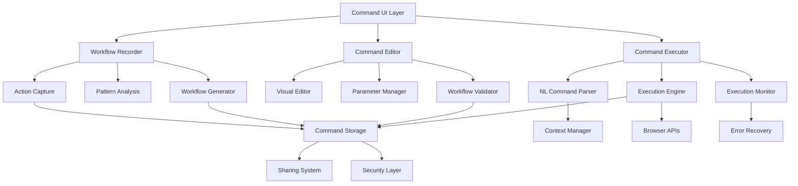

# Custom Command System - Design Document

## Overview

The Custom Command System enables users to create, customize, and execute personalized workflow automations through an intelligent recording and playback system. The design emphasizes user empowerment, flexibility, and reliability while maintaining security and privacy controls.

The system operates through a multi-layered architecture that captures user actions, analyzes workflow patterns, and provides robust execution with intelligent adaptation to changing web environments. It integrates seamlessly with the conversation system and cross-tab intelligence to provide context-aware automation.

## Architecture

### High-Level System Architecture



### Component Architecture

The system follows a modular architecture with clear separation between recording, editing, and execution:

**Recording Layer:**
- Action capture and event monitoring
- Intelligent element selection and identification
- Pattern recognition and workflow analysis
- Context extraction and parameterization

**Editing Layer:**
- Visual workflow editor with drag-and-drop interface
- Parameter definition and validation
- Conditional logic and branching
- Testing and debugging tools

**Execution Layer:**
- Natural language command parsing
- Robust workflow execution with error handling
- Real-time monitoring and progress tracking
- Adaptive element detection and recovery

**Storage Layer:**
- Encrypted command storage and versioning
- Sharing and collaboration features
- Performance analytics and optimization
- Security and permission management

## Components and Interfaces

### 1. Workflow Recorder

**Purpose:** Captures user actions and converts them into reusable workflow definitions

**Key Features:**
- Real-time action capture with intelligent filtering
- Robust element selection using multiple selector strategies
- Context-aware parameterization of dynamic content
- Smart workflow boundary detection and optimization

**Interface Definition:**
```typescript
interface WorkflowRecorder {
  startRecording(options: RecordingOptions): Promise<RecordingSession>;
  stopRecording(sessionId: string): Promise<WorkflowDefinition>;
  pauseRecording(sessionId: string): void;
  resumeRecording(sessionId: string): void;
  addManualStep(sessionId: string, step: ManualStep): void;
}

interface RecordingSession {
  id: string;
  startTime: Date;
  actions: CapturedAction[];
  context: RecordingContext;
  status: RecordingStatus;
}

interface CapturedAction {
  id: string;
  type: ActionType;
  target: ElementSelector;
  data: ActionData;
  timestamp: Date;
  context: ActionContext;
}
```

### 2. Command Editor

**Purpose:** Provides visual interface for customizing and refining workflow definitions

**Key Features:**
- Drag-and-drop workflow editing with step reordering
- Parameter definition with type validation and defaults
- Conditional logic builder with visual branching
- Real-time workflow testing and debugging

**Interface Definition:**
```typescript
interface CommandEditor {
  loadWorkflow(workflowId: string): Promise<EditableWorkflow>;
  saveWorkflow(workflow: EditableWorkflow): Promise<void>;
  testWorkflow(workflow: EditableWorkflow, testData: TestData): Promise<TestResult>;
  validateWorkflow(workflow: EditableWorkflow): ValidationResult;
}

interface EditableWorkflow {
  id: string;
  name: string;
  description: string;
  steps: WorkflowStep[];
  parameters: Parameter[];
  conditions: Condition[];
  metadata: WorkflowMetadata;
}

interface WorkflowStep {
  id: string;
  type: StepType;
  action: StepAction;
  target: ElementSelector;
  data: StepData;
  conditions: StepCondition[];
  errorHandling: ErrorHandling;
}
```

### 3. Command Executor

**Purpose:** Executes workflows with intelligent adaptation and error recovery

**Key Features:**
- Natural language command parsing and matching
- Robust element detection with fallback strategies
- Real-time execution monitoring and progress tracking
- Intelligent error recovery and user guidance

**Interface Definition:**
```typescript
interface CommandExecutor {
  executeCommand(command: string, context: ExecutionContext): Promise<ExecutionResult>;
  executeWorkflow(workflowId: string, parameters: WorkflowParameters): Promise<ExecutionResult>;
  cancelExecution(executionId: string): Promise<void>;
  getExecutionStatus(executionId: string): ExecutionStatus;
}

interface ExecutionResult {
  id: string;
  success: boolean;
  steps: StepResult[];
  duration: number;
  errors: ExecutionError[];
  output: ExecutionOutput;
}

interface StepResult {
  stepId: string;
  success: boolean;
  duration: number;
  error?: ExecutionError;
  output?: StepOutput;
}
```

### 4. Element Selector System

**Purpose:** Provides robust element identification that adapts to page changes

**Key Features:**
- Multiple selector strategies (CSS, XPath, text content, position)
- Intelligent fallback when primary selectors fail
- Machine learning-based element recognition
- Context-aware selector optimization

**Interface Definition:**
```typescript
interface ElementSelector {
  primary: SelectorStrategy;
  fallbacks: SelectorStrategy[];
  confidence: number;
  context: SelectorContext;
}

interface SelectorStrategy {
  type: SelectorType;
  value: string;
  weight: number;
  reliability: number;
}

interface ElementMatcher {
  findElement(selector: ElementSelector, context: PageContext): Promise<Element | null>;
  findSimilarElements(selector: ElementSelector, context: PageContext): Promise<Element[]>;
  updateSelector(selector: ElementSelector, element: Element): ElementSelector;
  validateSelector(selector: ElementSelector, context: PageContext): boolean;
}
```

### 5. Parameter Management System

**Purpose:** Handles workflow parameters with validation and context extraction

**Key Features:**
- Type-safe parameter definition and validation
- Context-aware parameter extraction from browser state
- Default value management and user input handling
- Parameter dependency resolution and validation

**Interface Definition:**
```typescript
interface ParameterManager {
  defineParameter(definition: ParameterDefinition): Parameter;
  validateParameters(parameters: WorkflowParameters): ValidationResult;
  extractFromContext(parameterName: string, context: BrowserContext): any;
  resolveDefaults(parameters: Parameter[]): WorkflowParameters;
}

interface Parameter {
  name: string;
  type: ParameterType;
  required: boolean;
  defaultValue?: any;
  validation: ValidationRule[];
  description: string;
  contextExtraction?: ContextExtraction;
}

interface ParameterDefinition {
  name: string;
  type: ParameterType;
  required: boolean;
  validation: ValidationRule[];
  description: string;
  defaultValue?: any;
}
```

### 6. Command Storage and Management

**Purpose:** Provides secure storage and organization for user commands

**Key Features:**
- Encrypted storage with user-controlled keys
- Version control and command history
- Organization with tags, folders, and search
- Usage analytics and optimization suggestions

**Interface Definition:**
```typescript
interface CommandStorage {
  saveCommand(command: WorkflowDefinition): Promise<string>;
  loadCommand(commandId: string): Promise<WorkflowDefinition>;
  deleteCommand(commandId: string): Promise<void>;
  searchCommands(query: SearchQuery): Promise<CommandSearchResult[]>;
  getCommandHistory(commandId: string): Promise<CommandVersion[]>;
}

interface CommandManager {
  createCommand(definition: WorkflowDefinition): Promise<Command>;
  updateCommand(commandId: string, updates: Partial<WorkflowDefinition>): Promise<void>;
  duplicateCommand(commandId: string, newName: string): Promise<Command>;
  organizeCommands(organization: CommandOrganization): Promise<void>;
}
```

## Data Models

### Workflow Definition Model

```typescript
interface WorkflowDefinition {
  id: string;
  name: string;
  description: string;
  version: string;
  steps: WorkflowStep[];
  parameters: Parameter[];
  triggers: Trigger[];
  metadata: WorkflowMetadata;
  security: SecuritySettings;
  createdAt: Date;
  updatedAt: Date;
}

interface WorkflowMetadata {
  category: string;
  tags: string[];
  usage: UsageStats;
  performance: PerformanceStats;
  reliability: ReliabilityStats;
}
```

### Execution Context Model

```typescript
interface ExecutionContext {
  userId: string;
  sessionId: string;
  browserContext: BrowserContext;
  parameters: WorkflowParameters;
  permissions: Permission[];
  preferences: ExecutionPreferences;
}

interface BrowserContext {
  activeTab: TabInfo;
  allTabs: TabInfo[];
  selectedText?: string;
  formData?: FormData;
  cookies: Cookie[];
  localStorage: Record<string, any>;
}
```

### Command Organization Model

```typescript
interface CommandOrganization {
  folders: CommandFolder[];
  tags: CommandTag[];
  favorites: string[];
  recentlyUsed: string[];
  customSortOrder: string[];
}

interface CommandFolder {
  id: string;
  name: string;
  description: string;
  commandIds: string[];
  subfolders: CommandFolder[];
  permissions: FolderPermissions;
}
```

## Error Handling

### Execution Error Recovery

**Element Not Found:**
- Try alternative selector strategies
- Search for similar elements with fuzzy matching
- Prompt user to update selector or skip step
- Provide visual element picker for manual selection

**Page Navigation Errors:**
- Retry navigation with exponential backoff
- Check for redirects and update workflow
- Handle authentication and permission prompts
- Provide manual navigation option with guidance

**Parameter Validation Errors:**
- Show specific validation error messages
- Suggest corrections based on parameter type
- Provide examples of valid input formats
- Allow parameter modification during execution

**Network and Timing Issues:**
- Implement intelligent wait strategies
- Retry failed operations with backoff
- Handle slow-loading content gracefully
- Provide offline execution where possible

### Error Response Format

```typescript
interface ExecutionError {
  type: ErrorType;
  stepId: string;
  message: string;
  userMessage: string;
  recoveryOptions: RecoveryOption[];
  canRetry: boolean;
  canSkip: boolean;
}

interface RecoveryOption {
  type: RecoveryType;
  description: string;
  action: RecoveryAction;
  confidence: number;
}
```

## Testing Strategy

### Unit Testing
- Workflow recording accuracy with various action types
- Element selector robustness across different page structures
- Parameter validation and type checking
- Command parsing and natural language understanding
- Error handling and recovery mechanism validation

### Integration Testing
- End-to-end workflow recording and execution
- Cross-browser compatibility for recorded workflows
- Integration with conversation system and cross-tab intelligence
- Real-world website compatibility and adaptation
- Performance testing with complex multi-step workflows

### User Experience Testing
- Workflow creation usability and learning curve
- Command execution reliability and user satisfaction
- Error message clarity and recovery guidance
- Performance impact on browser responsiveness
- Accessibility compliance for all interface elements

## Security and Privacy Considerations

### Data Protection
- **Encrypted Storage:** All workflow definitions encrypted with user keys
- **Sensitive Data Detection:** Automatic identification and parameterization of sensitive inputs
- **Permission Management:** Granular permissions for different types of browser actions
- **Audit Logging:** Comprehensive logging of command creation and execution
- **Secure Sharing:** Safe export/import with automatic sanitization

### Access Controls
- **Action Permissions:** Explicit consent required for sensitive browser operations
- **Domain Restrictions:** Commands can be restricted to specific domains or patterns
- **Execution Limits:** Rate limiting and resource usage controls
- **User Confirmation:** Required confirmation for potentially destructive actions
- **Sandbox Execution:** Isolated execution environment for untrusted commands

### Privacy Protection
- **Local Processing:** Workflow analysis and optimization performed locally
- **Data Minimization:** Only necessary data captured and stored
- **User Control:** Complete user control over data retention and sharing
- **Anonymization:** Personal data automatically anonymized in shared workflows
- **Consent Management:** Clear consent mechanisms for all data processing

## Performance Optimization

### Recording Performance
- **Efficient Event Capture:** Optimized event listeners with intelligent filtering
- **Background Processing:** Non-critical analysis performed in background threads
- **Memory Management:** Automatic cleanup of recording data and temporary files
- **Selective Recording:** Smart detection of relevant actions vs. noise
- **Compression:** Efficient storage of workflow definitions and execution history

### Execution Performance
- **Parallel Execution:** Safe parallelization of independent workflow steps
- **Caching:** Intelligent caching of element selectors and page analysis
- **Preloading:** Predictive loading of likely next steps and resources
- **Resource Monitoring:** Adaptive execution based on system resource availability
- **Optimization Suggestions:** AI-powered workflow optimization recommendations

### Scalability Considerations
- **Command Indexing:** Efficient indexing for fast command search and retrieval
- **Batch Operations:** Optimized batch processing for multiple command operations
- **Storage Optimization:** Compressed storage with deduplication for similar workflows
- **Cloud Sync:** Optional cloud synchronization for cross-device command access
- **Performance Analytics:** Continuous monitoring and optimization of system performance

This design provides a comprehensive foundation for implementing the Custom Command System while ensuring security, performance, and user experience excellence.