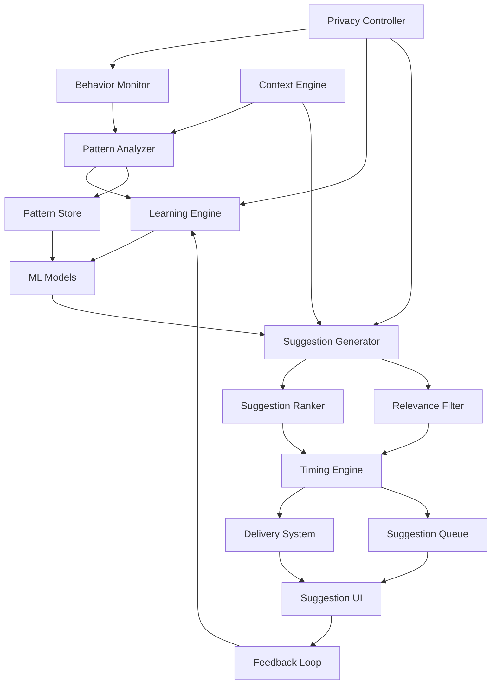

# Proactive Task Automation - Design Document

## Overview

Proactive Task Automation serves as the intelligent anticipation layer of Project Aura, continuously analyzing user behavior, context, and patterns to provide timely, relevant suggestions that enhance productivity without being intrusive. The system operates as a background intelligence service that learns, adapts, and proactively assists users in their daily workflows.

The design emphasizes privacy-first learning, contextual relevance, and intelligent timing to ensure suggestions feel helpful rather than disruptive. The system integrates deeply with other Aura components to provide comprehensive automation opportunities across all browser activities.

## Architecture

### High-Level System Architecture



### Component Architecture

The system follows an event-driven architecture with continuous learning and adaptation:

**Observation Layer:**
- Behavior monitoring and event capture
- Context extraction and analysis
- Privacy filtering and consent management
- Real-time activity tracking

**Analysis Layer:**
- Pattern recognition and classification
- Behavioral modeling and prediction
- Context correlation and relationship detection
- Temporal pattern analysis

**Intelligence Layer:**
- Machine learning model training and inference
- Suggestion generation and optimization
- Relevance scoring and ranking
- Timing optimization and delivery scheduling

**Interaction Layer:**
- Suggestion presentation and user interface
- Feedback collection and processing
- User preference management
- Privacy control interface

## Components and Interfaces

### 1. Behavior Monitor

**Purpose:** Continuously observes user actions while respecting privacy boundaries

**Key Features:**
- Non-intrusive activity tracking with intelligent filtering
- Privacy-aware data collection with user consent
- Real-time behavior analysis and pattern detection
- Context-sensitive monitoring with adaptive sensitivity

**Interface Definition:**
```typescript
interface BehaviorMonitor {
  startMonitoring(config: MonitoringConfig): void;
  stopMonitoring(): void;
  recordAction(action: UserAction): void;
  getActivitySummary(timeRange: TimeRange): ActivitySummary;
  setPrivacyLevel(level: PrivacyLevel): void;
}

interface UserAction {
  id: string;
  type: ActionType;
  timestamp: Date;
  context: ActionContext;
  metadata: ActionMetadata;
  privacyLevel: PrivacyLevel;
}

interface ActivitySummary {
  timeRange: TimeRange;
  actionCounts: Record<ActionType, number>;
  patterns: DetectedPattern[];
  contexts: ContextSummary[];
  productivity: ProductivityMetrics;
}
```

### 2. Pattern Analyzer

**Purpose:** Identifies behavioral patterns and workflow opportunities

**Key Features:**
- Advanced pattern recognition using machine learning
- Temporal pattern analysis for time-based suggestions
- Cross-context pattern detection spanning multiple activities
- Pattern confidence scoring and validation

**Interface Definition:**
```typescript
interface PatternAnalyzer {
  analyzePatterns(actions: UserAction[]): Promise<DetectedPattern[]>;
  identifyWorkflows(patterns: DetectedPattern[]): Promise<WorkflowPattern[]>;
  detectAnomalies(currentBehavior: UserAction[], historicalPatterns: DetectedPattern[]): Promise<Anomaly[]>;
  updatePatterns(feedback: PatternFeedback[]): Promise<void>;
}

interface DetectedPattern {
  id: string;
  type: PatternType;
  actions: UserAction[];
  frequency: number;
  confidence: number;
  context: PatternContext;
  suggestedAutomation?: AutomationSuggestion;
}

interface WorkflowPattern {
  id: string;
  name: string;
  steps: WorkflowStep[];
  triggers: PatternTrigger[];
  frequency: number;
  timesSaved: number;
  confidence: number;
}
```

### 3. Context Engine

**Purpose:** Provides rich contextual understanding for intelligent suggestions

**Key Features:**
- Real-time context extraction from browser state
- Multi-dimensional context analysis (temporal, spatial, semantic)
- Context correlation and relationship mapping
- Dynamic context adaptation based on user activity

**Interface Definition:**
```typescript
interface ContextEngine {
  getCurrentContext(): Promise<UserContext>;
  analyzeContextChange(previousContext: UserContext, currentContext: UserContext): ContextChange;
  predictContextEvolution(currentContext: UserContext, timeHorizon: number): Promise<ContextPrediction>;
  correlateContexts(contexts: UserContext[]): Promise<ContextCorrelation[]>;
}

interface UserContext {
  timestamp: Date;
  browserState: BrowserState;
  activeContent: ContentContext;
  userActivity: ActivityContext;
  temporalContext: TemporalContext;
  environmentalContext: EnvironmentalContext;
}

interface ContextChange {
  type: ChangeType;
  significance: number;
  triggers: ContextTrigger[];
  implications: ContextImplication[];
}
```

### 4. Suggestion Generator

**Purpose:** Creates contextually relevant and timely automation suggestions

**Key Features:**
- Multi-modal suggestion generation (automation, optimization, assistance)
- Context-aware suggestion customization
- Confidence-based suggestion filtering
- Personalized suggestion adaptation

**Interface Definition:**
```typescript
interface SuggestionGenerator {
  generateSuggestions(context: UserContext, patterns: DetectedPattern[]): Promise<Suggestion[]>;
  customizeSuggestion(suggestion: Suggestion, userPreferences: UserPreferences): Promise<Suggestion>;
  validateSuggestion(suggestion: Suggestion, context: UserContext): Promise<ValidationResult>;
  optimizeSuggestion(suggestion: Suggestion, feedback: SuggestionFeedback[]): Promise<Suggestion>;
}

interface Suggestion {
  id: string;
  type: SuggestionType;
  title: string;
  description: string;
  action: SuggestionAction;
  confidence: number;
  priority: number;
  context: SuggestionContext;
  benefits: SuggestionBenefit[];
  risks: SuggestionRisk[];
}

interface SuggestionAction {
  type: ActionType;
  parameters: ActionParameters;
  execution: ExecutionPlan;
  rollback?: RollbackPlan;
}
```

### 5. Timing Engine

**Purpose:** Determines optimal timing for suggestion delivery

**Key Features:**
- User attention and focus analysis
- Interruption cost calculation
- Optimal timing prediction based on user patterns
- Adaptive timing based on user feedback

**Interface Definition:**
```typescript
interface TimingEngine {
  calculateOptimalTiming(suggestion: Suggestion, context: UserContext): Promise<TimingRecommendation>;
  assessInterruptionCost(currentActivity: UserActivity): Promise<InterruptionCost>;
  scheduleDelivery(suggestion: Suggestion, timing: TimingRecommendation): Promise<DeliverySchedule>;
  adaptTiming(feedback: TimingFeedback[]): Promise<void>;
}

interface TimingRecommendation {
  suggestedTime: Date;
  confidence: number;
  reasoning: TimingReasoning;
  alternatives: AlternativeTiming[];
}

interface InterruptionCost {
  cost: number;
  factors: CostFactor[];
  recommendation: InterruptionRecommendation;
}
```

### 6. Learning Engine

**Purpose:** Continuously learns from user behavior and feedback to improve suggestions

**Key Features:**
- Reinforcement learning from user feedback
- Adaptive model updating based on behavior changes
- Personalization through preference learning
- Continuous model optimization and validation

**Interface Definition:**
```typescript
interface LearningEngine {
  updateModels(feedback: UserFeedback[]): Promise<void>;
  learnPreferences(userActions: UserAction[], suggestions: Suggestion[]): Promise<UserPreferences>;
  adaptToChanges(behaviorChange: BehaviorChange): Promise<void>;
  validateModelPerformance(): Promise<ModelPerformance>;
}

interface UserFeedback {
  suggestionId: string;
  action: FeedbackAction;
  rating?: number;
  comment?: string;
  context: FeedbackContext;
  timestamp: Date;
}

interface ModelPerformance {
  accuracy: number;
  precision: number;
  recall: number;
  userSatisfaction: number;
  improvementAreas: string[];
}
```

## Data Models

### User Behavior Model

```typescript
interface UserBehaviorProfile {
  userId: string;
  patterns: BehaviorPattern[];
  preferences: UserPreferences;
  workingHours: TimeRange[];
  focusPatterns: FocusPattern[];
  interruptionTolerance: InterruptionTolerance;
  productivityMetrics: ProductivityMetrics;
  lastUpdated: Date;
}

interface BehaviorPattern {
  id: string;
  type: PatternType;
  frequency: number;
  contexts: PatternContext[];
  triggers: PatternTrigger[];
  outcomes: PatternOutcome[];
  confidence: number;
}
```

### Suggestion Context Model

```typescript
interface SuggestionContext {
  browserContext: BrowserContext;
  userContext: UserContext;
  temporalContext: TemporalContext;
  taskContext: TaskContext;
  environmentalContext: EnvironmentalContext;
}

interface TaskContext {
  currentTask?: Task;
  taskHistory: Task[];
  taskPatterns: TaskPattern[];
  productivity: TaskProductivity;
}
```

### Learning Model

```typescript
interface LearningModel {
  modelId: string;
  type: ModelType;
  version: string;
  parameters: ModelParameters;
  performance: ModelPerformance;
  trainingData: TrainingDataSummary;
  lastTrained: Date;
}

interface ModelParameters {
  weights: number[];
  biases: number[];
  hyperparameters: Record<string, any>;
  featureImportance: FeatureImportance[];
}
```

## Error Handling

### Suggestion Generation Errors
- **Low Confidence Patterns:** Filter out suggestions below confidence threshold
- **Context Misinterpretation:** Provide fallback suggestions with clear reasoning
- **Timing Conflicts:** Queue suggestions and reschedule for appropriate times
- **Resource Constraints:** Prioritize high-value suggestions and defer others

### Learning System Errors
- **Model Degradation:** Automatic model retraining and validation
- **Feedback Inconsistencies:** Robust feedback processing with outlier detection
- **Data Quality Issues:** Data validation and cleaning with error reporting
- **Privacy Violations:** Immediate data purging and system lockdown

### User Experience Errors
- **Suggestion Fatigue:** Adaptive suggestion frequency based on user engagement
- **Irrelevant Suggestions:** Continuous relevance monitoring and adjustment
- **Timing Disruptions:** Learning from negative feedback to improve timing
- **Privacy Concerns:** Transparent data usage with granular control options

## Testing Strategy

### Behavioral Analysis Testing
- Pattern recognition accuracy with synthetic and real user data
- Context extraction precision across different browsing scenarios
- Learning algorithm effectiveness with various feedback patterns
- Privacy protection validation with sensitive data scenarios

### Suggestion Quality Testing
- Relevance scoring accuracy across different user contexts
- Timing optimization effectiveness with user satisfaction metrics
- Suggestion diversity and avoiding repetitive recommendations
- A/B testing for suggestion presentation and interaction design

### Performance Testing
- Real-time processing performance with continuous behavior monitoring
- Memory usage optimization with long-term behavior data storage
- Scalability testing with multiple concurrent users and suggestion generation
- Battery usage impact on mobile devices and resource-constrained environments

### Privacy and Security Testing
- Data anonymization effectiveness and privacy leak detection
- User consent mechanism validation and granular control testing
- Secure data storage and transmission with encryption validation
- Compliance testing with privacy regulations and user rights

## Security and Privacy Considerations

### Data Protection
- **Local Processing Priority:** Behavioral analysis performed locally when possible
- **Encrypted Storage:** All behavioral data encrypted with user-controlled keys
- **Data Minimization:** Only necessary data collected and stored for learning
- **Automatic Purging:** Configurable data retention with automatic cleanup
- **Anonymization:** Personal identifiers removed from shared or processed data

### Privacy Controls
- **Granular Permissions:** Fine-grained control over what behaviors are monitored
- **Opt-out Mechanisms:** Easy disabling of learning and suggestion features
- **Transparency Reports:** Clear reporting of data collection and usage
- **User Data Export:** Complete data export capabilities for user control
- **Deletion Rights:** Immediate and complete data deletion on user request

### Behavioral Privacy
- **Sensitive Context Detection:** Automatic identification and exclusion of private activities
- **Incognito Mode Respect:** No monitoring or learning during private browsing
- **Work/Personal Separation:** Separate behavioral profiles for different contexts
- **Temporal Privacy:** Time-based privacy controls for sensitive periods
- **Context-Aware Privacy:** Dynamic privacy levels based on current activity

## Performance Optimization

### Real-Time Processing
- **Efficient Pattern Matching:** Optimized algorithms for real-time pattern detection
- **Incremental Learning:** Continuous model updates without full retraining
- **Caching Strategies:** Intelligent caching of frequently accessed patterns and suggestions
- **Background Processing:** Non-critical analysis performed during idle time
- **Resource Monitoring:** Adaptive processing based on system resource availability

### Memory Management
- **Efficient Data Structures:** Optimized storage for behavioral data and patterns
- **Garbage Collection:** Automatic cleanup of outdated patterns and suggestions
- **Compression:** Compressed storage of historical behavioral data
- **Lazy Loading:** On-demand loading of behavioral analysis and suggestions
- **Memory Limits:** Configurable memory usage limits with graceful degradation

### Scalability Considerations
- **Distributed Processing:** Scalable architecture for multiple users and contexts
- **Model Optimization:** Efficient machine learning models with reduced computational requirements
- **Batch Processing:** Optimized batch processing for non-real-time analysis
- **Load Balancing:** Intelligent distribution of processing load across system resources
- **Performance Monitoring:** Continuous monitoring and optimization of system performance

This design provides a comprehensive foundation for implementing Proactive Task Automation while ensuring privacy protection, performance optimization, and user experience excellence.