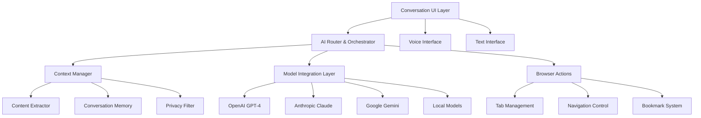

# Smart Conversation System - Design Document

## Overview

The Smart Conversation System serves as the central AI interface for Project Aura, providing users with an intelligent, context-aware conversational experience. The system is designed as a modular, extensible architecture that seamlessly integrates multiple AI models while maintaining high performance, privacy, and user control.

The design emphasizes progressive disclosure, contextual intelligence, and transparent AI interactions that feel native to the browsing experience rather than bolted-on. The system acts as both a standalone chat interface and an integrated component that enhances other browser features.

## Architecture

### High-Level System Architecture



### Component Architecture

The system follows a layered architecture with clear separation of concerns:

**Presentation Layer:**
- Conversation UI components (chat interface, input controls)
- Voice input/output handlers
- Animation and interaction controllers

**Business Logic Layer:**
- AI model routing and orchestration
- Context analysis and management
- Conversation memory and learning
- Privacy and security enforcement

**Integration Layer:**
- AI model API wrappers
- Browser API integrations
- Local storage and caching
- External service connectors

**Data Layer:**
- Conversation history storage
- User preferences and settings
- Context vectors and embeddings
- Performance and usage analytics

## Components and Interfaces

### 1. Conversation UI Component

**Purpose:** Provides the primary user interface for AI interactions

**Key Features:**
- Chat-style message bubbles with user/AI differentiation
- Real-time typing indicators and thinking animations
- Source citation display with clickable references
- Action buttons for common operations (copy, export, execute)
- Expandable/collapsible interface with draggable positioning

**Interface Definition:**
```typescript
interface ConversationUIProps {
  messages: ConversationMessage[];
  isLoading: boolean;
  onSendMessage: (message: string) => void;
  onVoiceInput: () => void;
  onClearHistory: () => void;
  contextPills: ContextPill[];
  suggestions: string[];
}

interface ConversationMessage {
  id: string;
  type: 'user' | 'ai' | 'system';
  content: string;
  timestamp: Date;
  sources?: SourceCitation[];
  actions?: MessageAction[];
  confidence?: number;
}
```

### 2. AI Router and Orchestrator

**Purpose:** Intelligently routes queries to appropriate AI models and manages responses

**Key Features:**
- Query analysis and intent classification
- Model selection based on query type and complexity
- Load balancing and fallback handling
- Response aggregation and synthesis
- Cost optimization and rate limiting

**Interface Definition:**
```typescript
interface AIRouter {
  routeQuery(query: string, context: ConversationContext): Promise<AIResponse>;
  selectModel(queryType: QueryType, complexity: number): AIModel;
  handleFallback(failedModel: AIModel, query: string): Promise<AIResponse>;
  aggregateResponses(responses: AIResponse[]): AIResponse;
}

interface AIResponse {
  content: string;
  model: string;
  confidence: number;
  sources: SourceCitation[];
  suggestedActions: Action[];
  processingTime: number;
}
```

### 3. Context Manager

**Purpose:** Extracts, analyzes, and manages contextual information from browser state

**Key Features:**
- Real-time tab content extraction
- Semantic similarity analysis
- Privacy-safe content filtering
- Context relevance scoring
- Cross-session context persistence

**Interface Definition:**
```typescript
interface ContextManager {
  extractContext(): Promise<BrowserContext>;
  analyzeRelevance(query: string, context: BrowserContext): RelevanceScore[];
  filterSensitiveContent(content: string): string;
  buildContextVector(content: string[]): ContextVector;
  persistContext(context: BrowserContext): void;
}

interface BrowserContext {
  activeTab: TabContext;
  allTabs: TabContext[];
  history: HistoryItem[];
  bookmarks: BookmarkItem[];
  userPreferences: UserPreferences;
}
```

### 4. Model Integration Layer

**Purpose:** Provides unified interface to multiple AI model providers

**Key Features:**
- Standardized API wrapper for all models
- Authentication and rate limit management
- Response caching and optimization
- Error handling and retry logic
- Performance monitoring and analytics

**Interface Definition:**
```typescript
interface ModelProvider {
  name: string;
  capabilities: ModelCapability[];
  sendQuery(query: string, context?: any): Promise<ModelResponse>;
  isAvailable(): boolean;
  getCost(query: string): number;
  getLatency(): number;
}

interface ModelResponse {
  content: string;
  confidence: number;
  usage: TokenUsage;
  metadata: ResponseMetadata;
}
```

### 5. Voice Interface Handler

**Purpose:** Manages voice input and output capabilities

**Key Features:**
- Speech-to-text conversion with noise filtering
- Text-to-speech with natural voice synthesis
- Voice activity detection
- Multi-language support
- Accessibility compliance

**Interface Definition:**
```typescript
interface VoiceHandler {
  startListening(): Promise<void>;
  stopListening(): void;
  speak(text: string, options?: SpeechOptions): Promise<void>;
  isListening(): boolean;
  getSupportedLanguages(): string[];
}
```

## Data Models

### Conversation Data Model

```typescript
interface Conversation {
  id: string;
  userId: string;
  title: string;
  messages: ConversationMessage[];
  context: ConversationContext;
  createdAt: Date;
  updatedAt: Date;
  metadata: ConversationMetadata;
}

interface ConversationContext {
  browserState: BrowserContext;
  userPreferences: UserPreferences;
  sessionInfo: SessionInfo;
  privacySettings: PrivacySettings;
}
```

### User Preferences Model

```typescript
interface UserPreferences {
  preferredModel: string;
  responseStyle: 'concise' | 'detailed' | 'technical';
  voiceEnabled: boolean;
  citationsEnabled: boolean;
  learningEnabled: boolean;
  privacyLevel: 'strict' | 'balanced' | 'permissive';
}
```

### Context Vector Model

```typescript
interface ContextVector {
  id: string;
  content: string;
  embedding: number[];
  source: ContextSource;
  relevanceScore: number;
  timestamp: Date;
}
```

## Error Handling

### Error Classification and Recovery

**Network Errors:**
- Automatic retry with exponential backoff
- Fallback to cached responses when available
- Offline mode with local processing
- Clear user communication about connectivity issues

**AI Model Errors:**
- Automatic failover to alternative models
- Graceful degradation of features
- User notification with suggested alternatives
- Error logging for improvement

**Context Errors:**
- Fallback to basic query processing
- Request for user clarification
- Partial context utilization
- Privacy-safe error reporting

**User Input Errors:**
- Intelligent query interpretation
- Suggestion of corrections or alternatives
- Progressive clarification requests
- Helpful error messages with examples

### Error Response Format

```typescript
interface ErrorResponse {
  type: ErrorType;
  message: string;
  userMessage: string;
  suggestedActions: string[];
  retryable: boolean;
  fallbackAvailable: boolean;
}
```

## Testing Strategy

### Unit Testing
- Component isolation testing with mock dependencies
- AI router logic validation with test scenarios
- Context extraction accuracy verification
- Privacy filter effectiveness testing
- Voice interface functionality validation

### Integration Testing
- End-to-end conversation flows
- Multi-model integration scenarios
- Browser API integration verification
- Real-time context updates testing
- Cross-session persistence validation

### Performance Testing
- Response time benchmarking under various loads
- Memory usage optimization validation
- Concurrent user simulation
- AI model latency measurement
- Context processing efficiency testing

### User Experience Testing
- Conversation flow usability studies
- Voice interface accessibility testing
- Error handling user experience validation
- Privacy control comprehension testing
- Cross-platform compatibility verification

## Security and Privacy Considerations

### Data Protection
- End-to-end encryption for conversation history
- Local processing for sensitive content analysis
- Anonymization of data sent to external AI models
- Secure token management for API authentication
- Regular security audits and vulnerability assessments

### Privacy Controls
- Granular permissions for context access
- User-controlled data retention policies
- Opt-out mechanisms for learning and storage
- Transparent data usage explanations
- GDPR and CCPA compliance implementation

### Content Filtering
- Automatic detection of sensitive information (PII, credentials)
- User confirmation for sharing sensitive context
- Configurable privacy levels with clear explanations
- Audit logs for data access and sharing
- Secure deletion of expired conversation data

## Performance Optimization

### Response Time Optimization
- Intelligent caching of common queries and responses
- Parallel processing of context analysis and AI queries
- Progressive response streaming for long answers
- Predictive pre-loading of likely follow-up queries
- Optimized model selection based on query complexity

### Resource Management
- Efficient memory usage with conversation history limits
- Background processing for non-critical operations
- Lazy loading of conversation history and context
- Optimized vector storage and retrieval
- Bandwidth optimization for mobile users

### Scalability Considerations
- Horizontal scaling of AI model integrations
- Load balancing across multiple model providers
- Caching layers for frequently accessed data
- Asynchronous processing for heavy operations
- Graceful degradation under high load

## Accessibility Features

### Visual Accessibility
- High contrast mode support for conversation interface
- Scalable fonts and adjustable text sizes
- Screen reader compatibility with proper ARIA labels
- Keyboard navigation for all interface elements
- Focus management for dynamic content updates

### Audio Accessibility
- Voice input with noise cancellation and clarity enhancement
- Natural text-to-speech with adjustable speed and voice selection
- Audio descriptions of visual elements and actions
- Support for hearing aids and assistive listening devices
- Subtitle display for voice interactions

### Motor Accessibility
- Voice-only interaction mode for users with limited mobility
- Customizable keyboard shortcuts for common actions
- Touch-friendly interface elements with appropriate sizing
- Gesture recognition for alternative input methods
- Integration with assistive technologies and switch controls

This design provides a comprehensive foundation for implementing the Smart Conversation System while maintaining flexibility for future enhancements and integrations with other Project Aura features.