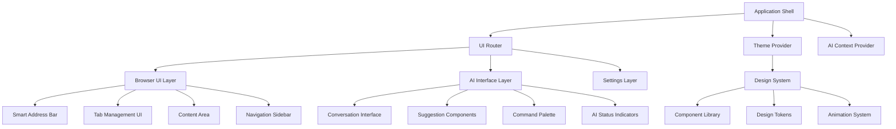

# UI Foundation - Design Document

## Overview

The UI Foundation provides the comprehensive React-based user interface framework for Project Aura, built with TypeScript and a custom design system. This foundation enables consistent, accessible, and performant user interfaces while supporting AI-native interactions and progressive disclosure of advanced features.

The design emphasizes modularity, reusability, and AI-enhanced components that adapt intelligently to user context and preferences while maintaining familiar browser interaction patterns.

## Architecture

### High-Level UI Architecture



### Component Architecture

**Application Layer:**
- Application shell and routing
- Global state management
- Theme and context providers
- Error boundaries and fallbacks

**Browser UI Layer:**
- Traditional browser interface components
- Tab management and navigation
- Content rendering and interaction
- Settings and preferences

**AI Interface Layer:**
- AI-enhanced components
- Conversation interfaces
- Proactive suggestions
- Command execution feedback

**Design System Layer:**
- Reusable component library
- Design tokens and theming
- Animation and interaction patterns
- Accessibility utilities

## Components and Interfaces

### 1. Design System Core

**Purpose:** Provides consistent design tokens, themes, and base styling for all components

**Key Features:**
- Comprehensive design token system
- Light/dark theme support with custom themes
- Responsive breakpoint system
- Accessibility-first design patterns

**Interface Definition:**
```typescript
interface DesignSystem {
  tokens: DesignTokens;
  themes: ThemeCollection;
  breakpoints: BreakpointSystem;
  animations: AnimationLibrary;
  accessibility: AccessibilityUtils;
}

interface DesignTokens {
  colors: ColorPalette;
  typography: TypographyScale;
  spacing: SpacingScale;
  shadows: ShadowSystem;
  borders: BorderSystem;
}

interface ThemeCollection {
  light: Theme;
  dark: Theme;
  custom: CustomTheme[];
}
```#
## 2. Component Library

**Purpose:** Comprehensive set of reusable React components with consistent styling and behavior

**Key Features:**
- Fully typed TypeScript components
- Accessibility-compliant implementations
- AI-enhanced variants for intelligent interactions
- Comprehensive testing and documentation

**Interface Definition:**
```typescript
interface ComponentLibrary {
  basic: BasicComponents;
  browser: BrowserComponents;
  ai: AIComponents;
  layout: LayoutComponents;
  forms: FormComponents;
}

interface BasicComponents {
  Button: React.ComponentType<ButtonProps>;
  Input: React.ComponentType<InputProps>;
  Select: React.ComponentType<SelectProps>;
  Modal: React.ComponentType<ModalProps>;
  Tooltip: React.ComponentType<TooltipProps>;
}

interface BrowserComponents {
  AddressBar: React.ComponentType<AddressBarProps>;
  TabBar: React.ComponentType<TabBarProps>;
  BookmarkBar: React.ComponentType<BookmarkBarProps>;
  StatusBar: React.ComponentType<StatusBarProps>;
}

interface AIComponents {
  ConversationPanel: React.ComponentType<ConversationProps>;
  SuggestionCard: React.ComponentType<SuggestionProps>;
  ThinkingIndicator: React.ComponentType<ThinkingProps>;
  ContextPill: React.ComponentType<ContextProps>;
}
```

### 3. Smart Address Bar Component

**Purpose:** AI-enhanced address bar that serves as the primary interaction point for both navigation and AI queries

**Key Features:**
- Dual-mode operation (URL/AI query)
- Contextual suggestions and completions
- Voice input integration
- Progressive disclosure of advanced features

**Interface Definition:**
```typescript
interface SmartAddressBar {
  mode: 'url' | 'ai' | 'hybrid';
  value: string;
  suggestions: Suggestion[];
  isLoading: boolean;
  onModeChange: (mode: AddressBarMode) => void;
  onSubmit: (query: string, mode: AddressBarMode) => void;
  onVoiceInput: () => void;
}

interface Suggestion {
  type: 'url' | 'search' | 'ai' | 'command';
  content: string;
  description?: string;
  confidence: number;
  action: () => void;
}
```

### 4. Tab Management System

**Purpose:** Advanced tab organization with Spaces, Groups, and AI-enhanced features

**Key Features:**
- Vertical and horizontal tab layouts
- Visual tab grouping and spaces
- AI-generated tab titles and organization
- Drag-and-drop reordering and grouping

**Interface Definition:**
```typescript
interface TabManagementUI {
  layout: 'horizontal' | 'vertical' | 'grid';
  spaces: Space[];
  activeSpaceId: string;
  activeTabId: string;
  onTabCreate: (options: TabCreateOptions) => void;
  onTabClose: (tabId: string) => void;
  onTabMove: (tabId: string, targetGroupId: string) => void;
  onSpaceSwitch: (spaceId: string) => void;
}

interface Space {
  id: string;
  name: string;
  color: string;
  groups: TabGroup[];
  aiSuggestions?: SpaceSuggestion[];
}
```

### 5. AI Conversation Interface

**Purpose:** Primary interface for AI interactions with support for multi-turn conversations

**Key Features:**
- Chat-style message interface
- Source citations and references
- Action buttons and quick replies
- Voice input/output support

**Interface Definition:**
```typescript
interface ConversationInterface {
  messages: ConversationMessage[];
  isTyping: boolean;
  contextPills: ContextPill[];
  suggestions: QuickReply[];
  onSendMessage: (message: string) => void;
  onVoiceToggle: () => void;
  onClearHistory: () => void;
}

interface ConversationMessage {
  id: string;
  type: 'user' | 'ai' | 'system';
  content: string;
  timestamp: Date;
  sources?: SourceCitation[];
  actions?: MessageAction[];
  confidence?: number;
}
```

### 6. Suggestion and Notification System

**Purpose:** Non-intrusive display of AI suggestions and proactive recommendations

**Key Features:**
- Contextual suggestion cards
- Dismissible notifications
- Progressive disclosure of details
- User feedback collection

**Interface Definition:**
```typescript
interface SuggestionSystem {
  suggestions: Suggestion[];
  notifications: Notification[];
  position: 'top' | 'bottom' | 'sidebar';
  onSuggestionAccept: (suggestionId: string) => void;
  onSuggestionDismiss: (suggestionId: string) => void;
  onFeedback: (suggestionId: string, feedback: Feedback) => void;
}

interface Suggestion {
  id: string;
  type: SuggestionType;
  title: string;
  description: string;
  confidence: number;
  estimatedTimeSaving?: string;
  actions: SuggestionAction[];
}
```

## Data Models

### UI State Management

```typescript
interface UIState {
  theme: ThemeState;
  layout: LayoutState;
  browser: BrowserUIState;
  ai: AIUIState;
  user: UserPreferences;
}

interface ThemeState {
  current: 'light' | 'dark' | 'custom';
  customThemes: CustomTheme[];
  systemPreference: boolean;
}

interface LayoutState {
  sidebarCollapsed: boolean;
  tabLayout: 'horizontal' | 'vertical';
  density: 'compact' | 'normal' | 'spacious';
  activeSpace: string;
}
```

### Component Props Patterns

```typescript
interface BaseComponentProps {
  className?: string;
  testId?: string;
  disabled?: boolean;
  loading?: boolean;
  variant?: ComponentVariant;
}

interface AIEnhancedProps extends BaseComponentProps {
  aiEnabled?: boolean;
  aiSuggestions?: AISuggestion[];
  onAIAction?: (action: AIAction) => void;
}
```

## Responsive Design System

### Breakpoint Strategy
- **Mobile**: 320px - 768px (touch-first, simplified UI)
- **Tablet**: 768px - 1024px (hybrid touch/mouse, adaptive layout)
- **Desktop**: 1024px - 1440px (full feature set, keyboard shortcuts)
- **Wide**: 1440px+ (enhanced layouts, multiple panels)

### Adaptive Components
- Automatic layout switching based on screen size
- Touch-friendly interactions on mobile devices
- Keyboard navigation optimization for desktop
- Progressive enhancement of features

## Accessibility Framework

### WCAG 2.1 AA Compliance
- Semantic HTML structure for all components
- Proper ARIA labels and descriptions
- Keyboard navigation support
- Screen reader compatibility
- Color contrast compliance

### AI Accessibility Features
- Voice input/output for hands-free interaction
- Audio descriptions of AI actions
- High contrast mode support
- Reduced motion preferences
- Clear error messages and recovery options

## Performance Optimization

### Rendering Performance
- React.memo for expensive components
- Virtual scrolling for large lists
- Lazy loading of non-critical components
- Efficient re-rendering strategies

### Bundle Optimization
- Code splitting by feature and route
- Tree shaking of unused components
- Dynamic imports for heavy components
- Optimized asset loading and caching

### Animation Performance
- Hardware-accelerated animations
- 60fps performance targets
- Reduced motion support
- Efficient transition strategies

## Testing Strategy

### Component Testing
- Unit tests for all components
- Visual regression testing
- Accessibility testing automation
- Performance benchmarking

### Integration Testing
- Cross-component interaction testing
- Theme switching validation
- Responsive design testing
- AI feature integration testing

### User Experience Testing
- Usability testing with real users
- A/B testing for key interactions
- Performance impact assessment
- Accessibility validation with assistive technologies

## Development Workflow

### Component Development
- Storybook for component development and documentation
- Design system documentation and guidelines
- Automated testing and quality gates
- Design review and approval process

### Design Handoff
- Figma to code workflow
- Design token synchronization
- Asset optimization and delivery
- Cross-platform consistency validation

This design provides the comprehensive UI foundation that all Project Aura features will build upon, ensuring consistency, accessibility, and AI-native interactions throughout the application.